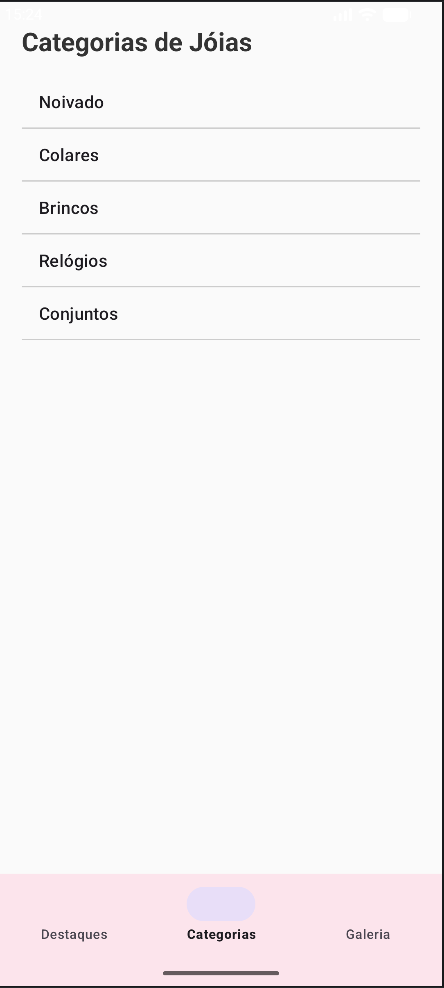
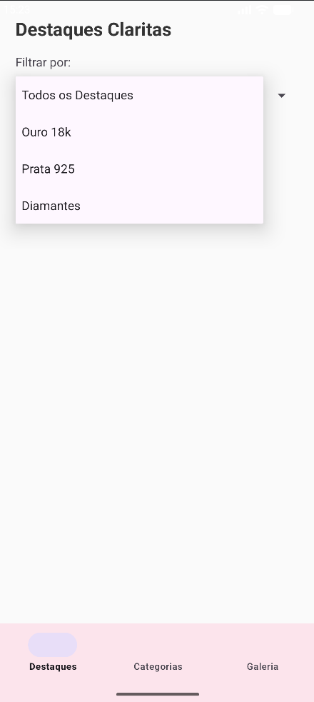
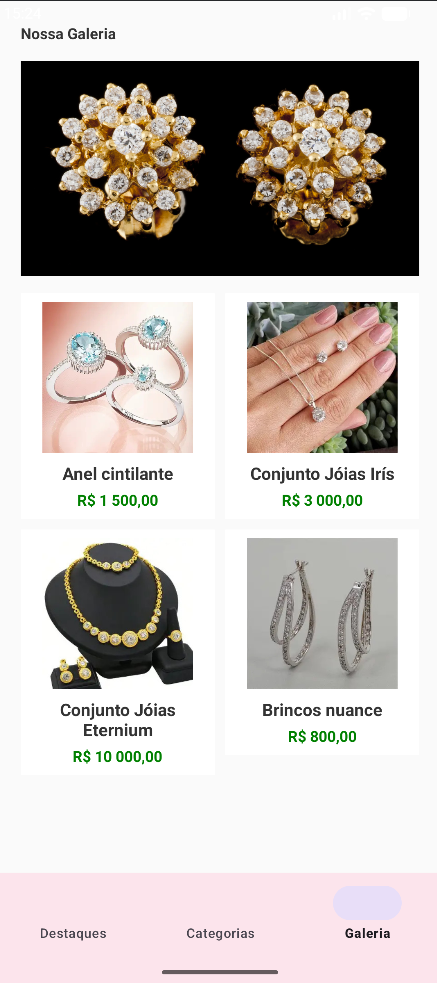

# UFMS_ProgMob_VitrineVirtualJoias
Atividade Avaliativa da disciplina de Programacao Mobile - criacao de aplicativo movel.

* **Faculdade:** UFMS
* **Curso:** Engenharia de Software
* **Ferramentas:**
  - Android Studio
 
### Descrição simplificada:
Este repositório concentra as entregas das atividades avaliativas realizadas ao longo da disciplina de Programação Mobile. O objetivo principal é a construção de um aplicativo no Android Studio com linguagem de programação Java aplicando os conceitos apreendidos ao longo das aulas.

### Vitrine Virtual de Joias
A ideia do Aplicativo Vitrine Virtual de Joias é um protótipo funcional de um e-commerce voltado para o mercado de joalheria. Projetado com uma interface limpa e navegação intuitiva, o aplicativo simula a experiência de um catalogo digital interativo para os clientes da loja. A aplicação é formada, a priori, por três telas principais - Fragmentos - gerenciadas por uma barra de navegação inferior(Bottom Navigation). Arquiteturalmente, a interface e as funcionalidades estão divididas em:
* Abas de Destaques: A tela inicial do aplicativo, que abriga um menu suspenso interativo(Spinner) estruturado a partir de dados em XML, permitindo ao cliente filtrar o catálogo por materiais especificos.
* Aba de Categorias: Uma seção de navegação organizada em um formato de lista clássica(ListView), que mapeia os principais setores da loja.
* Aba de Galeria: A vitrine visual interativa construida com uma grade personalizada(Grid View), alimentada por um Adapter em Java. Ela exibe as imagens e informações das Jóias lado a lado e fornece feedback imediato ao usuário através de mensagens flutuantes(Toasts) e efeitos sonoros(MediaPlayer) durante as interações.

 
### Entrega 1:
#### Requisitos:
* Utilização de Basic Activity ou Bottom Navigation Activity;
* Projeto com pelo menos 3 Fragmentos;
* Ter no mínimo: 1 Spinner, 1 ListView, 1 GridView, Sons, Cores Imagens;
* Ações sobre os itens do Spinner, do List e do Grid;
* strings e strings-arry devem estar no arquivo strings.xml.

  
  
  

  
⚠ **Atenção**: Material com fins de aprendizado, e assim sendo, pode conter **erros** e **insconsistências**.

* ### **Links e material de apoio** 📖
<!--
 - [Modelo Conceitual](https://fernandommota.github.io/academy/disciplines/2015/analise_projeto_software/files/08_modelo_conceitual.pdf)
 - [Diagrama de Classes](https://deinf.ufma.br/~geraldo/dob/7.Classes.pdf)
 - [C4 Model](https://medium.com/cajudevs/entendendo-o-c4-model-uma-abordagem-para-arquitetura-de-software-3ed0f007ae66) ->
